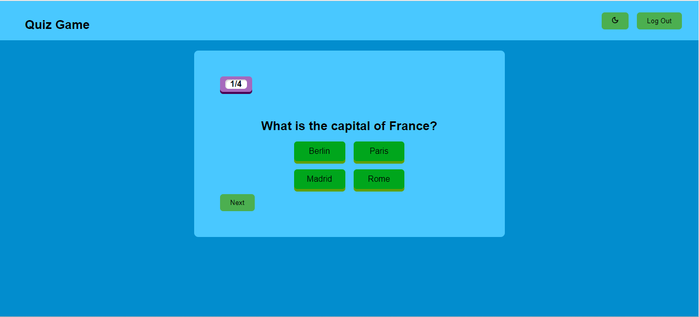

# Quiz App

Welcome to the New Quiz App! This application is designed to provide an engaging and interactive quiz experience for users. Test your knowledge on various topics and challenge yourself with a variety of questions.

## Screenshots

## Technologies Used

- **React:** The app is built using React, a popular JavaScript library for building user interfaces.
- **React Router:** Navigation within the app is managed using React Router for a seamless single-page application experience.
- **Styled Components:** Styles are implemented using Styled Components, a CSS-in-JS library that allows for component-based styling.
- **State Management:** React Hooks are used for state management, ensuring a clean and efficient way to handle application state.

## Features

- **Take Quizzes:** Explore a variety of quiz categories and test your knowledge in different subjects.
- **Score Tracking:** Receive instant feedback on your quiz performance and view your final score.

## Getting Started

1. Clone the repository.
2. Install dependencies using `npm i`.
3. Start the development server with `npm run dev`.

